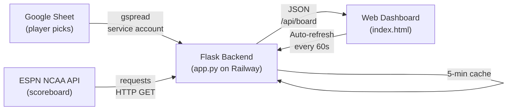
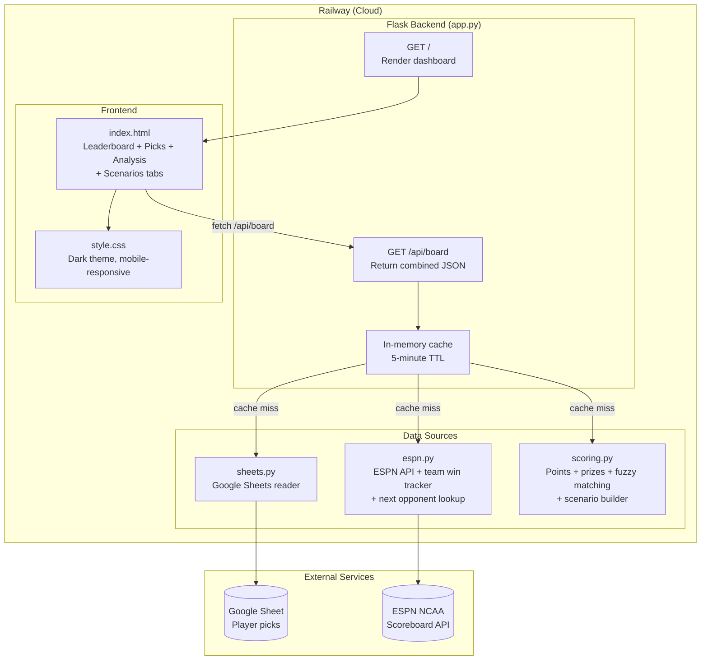

# NCAA Pick 8 Pool — Product Requirements Document

## Overview
A web dashboard for a March Madness Pick 8 pool that combines player picks from a Google Sheet with live NCAA tournament data from ESPN. The 2026 pool has 24 entries ($480 total pot), placing it in the 20+ prize tier. Players accumulate points based on how many wins their chosen teams earn, weighted by seed number. The app is deployed on Railway and accessible to all pool participants via a public URL.

**Live URL**: https://ncaa-pick8-production.up.railway.app

## Problem
Running a Pick 8 pool manually requires tracking every team's wins across 63 games, calculating points per player, and updating a leaderboard by hand. Participants have no real-time visibility into standings or how their picks are performing.

## Solution
A lightweight web app that reads player picks from a Google Sheet and enriches them with live ESPN tournament data, automatically scoring wins and displaying a real-time leaderboard, picks breakdown, analysis heat map, and scenario planner.

## Users
- **Pool participants** — view standings, track their picks, and see the leaderboard
- **Pool administrator** — maintains the Google Sheet with player names and picks

## Pool Rules

### Scoring
- Each player selects **8 teams** from the 2026 NCAA Tournament field
- For every win a team earns, the player receives **points equal to the team's seed number**
  - Example: St. John's (seed #5) wins 2 games → 10 points
  - Example: High Point (seed #12) wins 1 game → 12 points
- Higher-seed (lower-ranked) upsets are therefore more valuable
- **First Four play-in games do not count** — scoring starts with Round of 64
- Maximum possible points per team = seed × 6 (winning all 6 games through the Championship)

### Entry Fee
- $20 per person

### Prize Schedule

| Entries | 1st Place | 2nd Place | 3rd Place | 4th Place |
|---|---|---|---|---|
| < 10 | Rest of pot | $20 (buy-in back) | — | — |
| 10–19 | Rest of pot | 25% of pot | $20 (buy-in back) | — |
| 20+ | Rest of pot | 20% of pot | 10% of pot | $20 (buy-in back) |

## Core Features

### 1. Leaderboard Tab
- Ranked by current points (highest first)
- Shows: rank, player name, current points, potential points remaining, current prize (if standings held)
- Player names are clickable — navigates directly to that player's picks card
- Total pot and prize breakdown shown at top

### 2. Picks Tab
- One card per player showing all 8 picks
- Each pick shows: team name, seed, wins to date, points earned, max remaining points, status (alive ✅ / eliminated ❌ / unmatched ❓)
- Eliminated teams shown with strikethrough
- Fuzzy-matched names show the original entered name as a note

### 3. Analysis Tab (Heat Map)
- Grid of tiles — one per unique team picked across all players
- Each tile shows team name, seed, points earned so far, and pick count
- Tiles color-coded by pick frequency (cool blue → warm orange = most picked)
- Sorted by most-picked first, then by seed
- Clicking a tile opens a modal showing which players picked that team
- Player names in the modal link directly to their picks card

### 4. Scenarios Tab
- One card per player showing their win/elimination status
- **Root For** — their remaining alive teams sorted by potential points, with next opponent shown
- **Root Against** — rivals' high-value alive teams they don't share, deduplicated by team with all rival pickers listed (e.g. "+55 pts for Andy P, Leo")
- Contention badge: 🏆 Leading / ✅ In Contention / ❌ Eliminated
- Points needed to take the lead shown for players not currently leading
- Best case score shown for each player

### 5. Auto-Refresh
- Dashboard refreshes every 60 seconds via JS fetch
- Server-side cache means most refreshes return instantly (see Caching)
- Timestamp shown for last update

## Caching

The `/api/board` response is cached in memory for **5 minutes**. This means:
- First load (or after cache expires) fetches fresh data from Google Sheets + ESPN
- All subsequent requests within 5 minutes return the cached result instantly
- Only 1 gunicorn worker runs so all requests share the same cache

Cache TTL is configurable via the `CACHE_TTL_SECONDS` env var (default: `300`).

## Data Flow



## Architecture



## Google Sheet Format

```
Column-oriented layout:
  Row 1:   "Name",  Player1,  Player2,  Player3, ...
  Row 2-9: "Picks", pick1,    pick1,    pick1,   ...
```

- Each column after A represents one player
- Row 1 contains player names; rows 2–9 contain their 8 team picks
- Team names are matched to ESPN names using fuzzy matching (handles typos, seed suffixes, capitalization differences)

### Accepted Team Name Formats
The app handles common entry variations:
- Exact ESPN name: `VCU`
- With seed suffix: `VCU - 11` (seed stripped automatically before matching)
- Typos: `Miami Onhio` → `Miami OH`
- Case differences: `Vcu` → `VCU`, `Byu` → `BYU`
- Curly quotes / special characters: `St. John's` → `St John's`

## Fuzzy Name Matching

Team name matching uses a 5-step process:

1. Strip trailing seed annotation (e.g. `VCU - 11` → `VCU`)
2. Exact match
3. Case-insensitive match
4. Normalized match (strip accents, punctuation, extra spaces)
5. Fuzzy match via `difflib.get_close_matches` (cutoff: 0.75)

Unmatched teams show `seed: "?"` and earn 0 points; the original entered name is preserved for display.

## Scoring Logic

```
current_points = sum(seed × wins) for each picked team
potential_left  = sum(seed × (6 - wins)) for each picked team still alive
best_case       = current_points + potential_left
```

Teams are pulled from ESPN game results. Win counts exclude First Four games.

## Scenario Logic

For each player:
- **in_contention**: `best_case > leader's current_points`
- **points_needed**: `max(0, leader_current - player_current + 1)`
- **root_for**: alive picks sorted by `potential_left` descending, with `next_opponent` from ESPN upcoming games
- **root_against**: rivals' alive teams not shared with this player, deduplicated by team, sorted by `potential_left` descending, top 6 shown

## File Structure

```
~/ncaa-pick8/
├── app.py              # Flask routes — GET /, /api/board + 5-min cache
├── sheets.py           # Google Sheets reader (player picks)
├── espn.py             # ESPN NCAA API fetcher + team wins + next opponent
├── scoring.py          # Points, potential, prizes, fuzzy matching, scenarios
├── templates/
│   └── index.html      # Dashboard — Leaderboard, Picks, Analysis, Scenarios tabs
├── static/
│   └── style.css       # Dark theme, mobile-responsive
├── Dockerfile          # Python 3.11 + gunicorn for Railway
├── requirements.txt    # flask, gspread, google-auth, requests, gunicorn
├── start.sh            # Gunicorn startup (1 worker, 120s timeout)
├── streamlit_app.py    # Experimental Streamlit UI (uses same backend modules)
└── .gitignore
```

## Tech Stack
- **Backend**: Python 3.11 + Flask (served via gunicorn, 1 worker)
- **Google Sheets**: gspread + google-auth (service account)
- **Tournament Data**: ESPN public NCAA scoreboard API (no auth required)
- **Frontend**: Vanilla HTML/CSS/JS (no framework)
- **Deployment**: Railway (Docker, auto-deploys from GitHub on push)

## Deployment

### Railway (Production)
- **URL**: https://ncaa-pick8-production.up.railway.app
- **Docker**: Python 3.11-slim + gunicorn (1 worker)
- **Env vars**: `NCAA_SHEET_ID`, `NCAA_GRID_TAB`, `GOOGLE_CREDENTIALS_B64`, `PORT` (8080), `CACHE_TTL_SECONDS` (optional)
- **Auto-deploy**: Pushes to `main` trigger automatic redeploy

### Local Development
```bash
cd ~/ncaa-pick8
source venv/bin/activate
NCAA_SHEET_ID="<your-sheet-id>" NCAA_GRID_TAB="2026" python app.py
# Open http://localhost:5001
```

## Configuration

| Variable | Where | Default | Description |
|---|---|---|---|
| `NCAA_SHEET_ID` | Railway env var | — | Google Sheet ID |
| `NCAA_GRID_TAB` | Railway env var | `Sheet1` | Tab name (e.g. `2026`) |
| `PORT` | Railway env var | `8080` | Server port |
| `GOOGLE_CREDENTIALS_B64` | Railway env var | — | Base64-encoded service account JSON |
| `CACHE_TTL_SECONDS` | Railway env var | `300` | Cache lifetime in seconds |

## Known Limitations
- In-memory cache is lost on server restart (cold start will be slow)
- No authentication — anyone with the URL can view the dashboard
- ESPN API is undocumented and could change without notice
- Tournament date window is hardcoded to mid-March through early April of the current year
- First Four games appear in ESPN data but are excluded from scoring
- Scenario analysis is mathematical only — does not account for actual bracket matchups beyond next opponent

## Future Enhancements
- Bracket-aware full scenario simulation (Option C) — enumerate outcomes for games involving picked teams only
- Win probability percentages via Monte Carlo simulation
- Historical year-over-year comparison
- Push notifications when standings change
